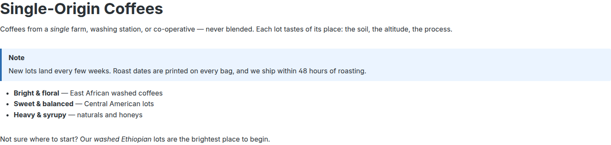
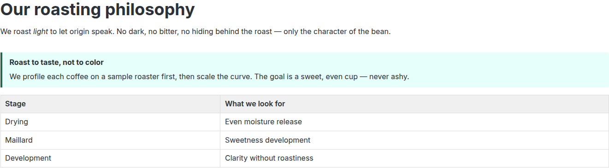
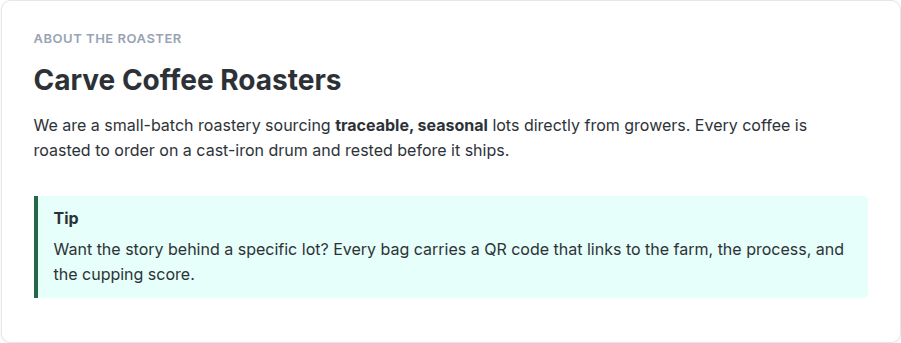
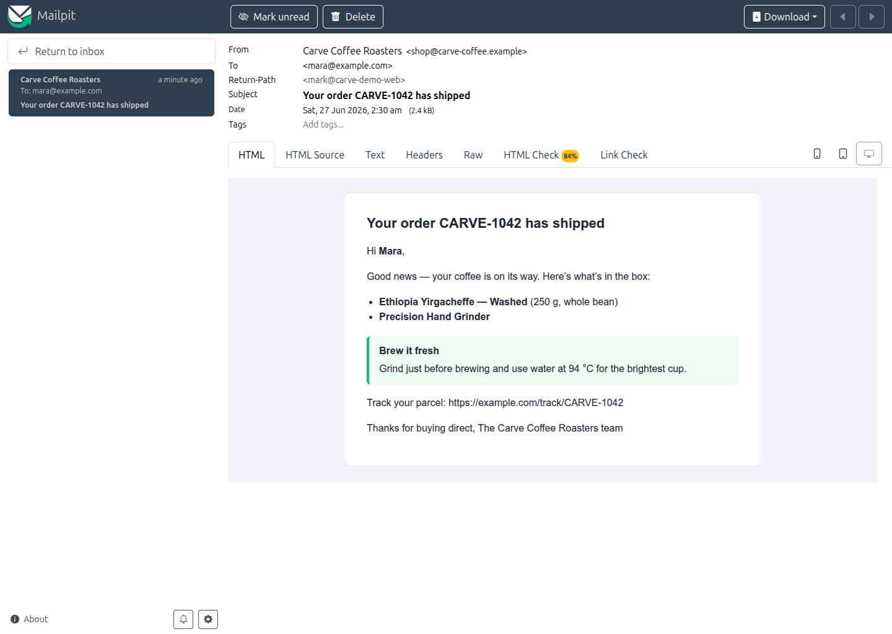
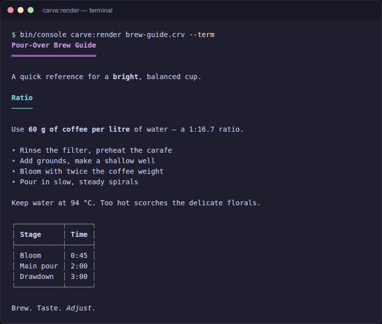

# Gallery

These screenshots are from a demo shop themed as a small single-origin coffee
roaster ("Carve Coffee Roasters"). Each shows one of the plugin's surfaces
rendering real Carve markup. The flagship product is *Ethiopia Yirgacheffe -
Washed*; a *Precision Hand Grinder* is used for the inline product reference.

Every image is the genuine renderer output - the same `CarveRenderer` /
carve-js code paths the plugin ships. Where a surface has no native storefront
page (the manufacturer field), that is called out explicitly below.

> The Carve source uses single `*` for bold and `/` for italic (Carve syntax,
> not Markdown). `---` / `--` render as em/en dashes via the smart-typography
> extension.

---

## Product custom field `carve_body` (Surface 3)

The product description is authored as plain-text Carve and rendered under the
core description. Note the rich constructs: a `tip` and a `warning` admonition,
a `list-table`, a pipe table with column alignment, and an inline
`:product[...]` reference resolved to a live link (Surface 8) in the last line.


```carve
# Ethiopia Yirgacheffe --- Washed

A bright, floral single-origin from the *Gedeo Zone*, grown at 1,900--2,100 m and
washed at the village station. Expect jasmine on the nose and a clean, tea-like body.

## Tasting notes

/Floral, citric, delicate./ We taste *jasmine*, *bergamot*, and a finish of
*white peach*.

::: tip "Brew it bright"
This lot shines as a pour-over. Keep the water just off the boil (94 °C) and don't
over-extract --- the florals fade fast.
:::

## Brew guide

{header-rows=1}
::: list-table "Recipe by method"
- - Method
  - Ratio
  - Grind
  - Time
- - V60
  - 1:16
  - Medium-fine
  - 2:45
- - Aeropress
  - 1:14
  - Fine
  - 1:30
- - Batch brew
  - 1:17
  - Medium
  - 6:00
:::

## At a glance

|= Attribute |=> Value          |
| Origin     |  Gedeo, Ethiopia |
| Process    |  Washed          |
| Altitude   |  1,900--2,100 m  |
| Roast      |  Light           |

::: warning "Storage"
Keep the bag sealed and away from light. Whole bean stays bright for about three
weeks after the roast date --- grind only what you brew.
:::

Pairs perfectly with our :product[CARVE-B] for a consistent, fluffy grind.
```

---

## Inline product reference `:product[SKU]` (Surface 8)

The closing line of the product copy above, `:product[CARVE-B]`, resolves against
the current sales channel to a live link ("Precision Hand Grinder"). Unknown or
out-of-stock SKUs degrade to inert text rather than throwing.

---

## Category custom field `carve_body` (Surface 4)

Rich landing copy at the top of a category listing: an italic lead, a `note`
admonition, and a bold bullet list.



```carve
# Single-Origin Coffees

Coffees from a /single/ farm, washing station, or co-operative --- never blended.
Each lot tastes of its place: the soil, the altitude, the process.

::: note
New lots land every few weeks. Roast dates are printed on every bag, and we ship
within 48 hours of roasting.
:::

- *Bright & floral* --- East African washed coffees
- *Sweet & balanced* --- Central American lots
- *Heavy & syrupy* --- naturals and honeys

Not sure where to start? Our /washed Ethiopian/ lots are the brightest place to begin.
```

---

## Carve CMS element (Surface 2)

A `carve` element dropped into a Shopping Experience renders server-side through
`CarveRenderer::toHtml()`. Here it provides a "roasting philosophy" landing block
with a `tip` admonition and a table.



```carve
# Our roasting philosophy

We roast /light/ to let origin speak. No dark, no bitter, no hiding behind the
roast --- only the character of the bean.

::: tip "Roast to taste, not to color"
We profile each coffee on a sample roaster first, then scale the curve. The goal is
a sweet, even cup --- never ashy.
:::

| Stage       | What we look for           |
|-------------|----------------------------|
| Drying      | Even moisture release      |
| Maillard    | Sweetness development      |
| Development | Clarity without roastiness |
```

---

## Manufacturer field `carve_manufacturer_body` (Surface 5)

The manufacturer field is **filter-only** - Shopware core has no native
storefront manufacturer page, so a theme decides where to render it. The image
below is the genuine `|carve` output (rendered with the plugin's CLI for this
gallery) placed in a brand card exactly where a theme would show the roaster on
the product page.



```carve
## Carve Coffee Roasters

We are a small-batch roastery sourcing *traceable, seasonal* lots directly from
growers. Every coffee is roasted to order on a cast-iron drum and rested before it
ships.

::: tip
Want the story behind a specific lot? Every bag carries a QR code that links to the
farm, the process, and the cupping score.
:::
```

---

## Admin live preview (Surface 6)

While editing a Carve CMS element, the config modal shows the raw source and a
live preview whose HTML is byte-identical to the storefront (carve-js and
carve-php share a cross-implementation test corpus). The admin preview shows the
structural HTML; the storefront theme adds the callout/table styling.


---

## Product reviews / UGC (Surface 9)

With `renderReviews` enabled, review text renders through `|carve_ugc` using the
hardened **comment profile**. Basic formatting survives; everything risky
degrades to inert text. In this review:

- `*best*` and `/floral/` render as bold/italic, and the bare URL becomes a link.
- A `## heading` is denied and shown as literal text.
- An image is denied and shown as a `[img: ...]` placeholder.
- A raw `<script>` is escaped to inert text - never executed.


```carve
The *best* Yirgacheffe I've brewed at home --- super /floral/, exactly the jasmine
note in the tasting notes. Full brew log here: https://example.com/brewlog

## I tried to sneak in a heading


<script>alert('xss')</script>
```

---

## Transactional mail (Surface 7)

One Carve source feeds both the HTML and plain-text parts of a multipart mail
(the **Text** tab in the viewer shows the plain part). Admonitions and inline
formatting carry into the email body.



```carve
# Your order CARVE-1042 has shipped

Hi *Mara*,

Good news --- your coffee is on its way. Here's what's in the box:

- *Ethiopia Yirgacheffe --- Washed* (250 g, whole bean)
- *Precision Hand Grinder*

::: tip "Brew it fresh"
Grind just before brewing and use water at 94 °C for the brightest cup.
:::

Track your parcel: https://example.com/track/CARVE-1042

Thanks for buying direct,
The Carve Coffee Roasters team
```

---

## Multi-target CLI `carve:render` (Surface 10)

The same source renders to HTML, Markdown, plain text, or ANSI from the console.
Below is the `--term` (ANSI) output: colored headings, bold/italic runs, a
box-drawn table.



```carve
# Pour-Over Brew Guide

A quick reference for a *bright*, balanced cup.

## Ratio

Use *60 g of coffee per litre* of water --- a 1:16.7 ratio.

- Rinse the filter, preheat the carafe
- Add grounds, make a shallow well
- Bloom with twice the coffee weight
- Pour in slow, steady spirals

::: tip
Keep water at 94 °C. Too hot scorches the delicate florals.
:::

| Stage    | Time |
|----------|------|
| Bloom    | 0:45 |
| Main pour | 2:00 |
| Drawdown | 3:00 |

Brew. Taste. /Adjust./
```

---

## Twig filters (Surface 1)

The `|carve`, `|carve_text`, `|carve_md`, `|carve_ctx`, and `|carve_ugc` filters
are the primitive every surface above builds on. The product, category, CMS,
manufacturer, mail, and review images are all filter output in different
contexts.
