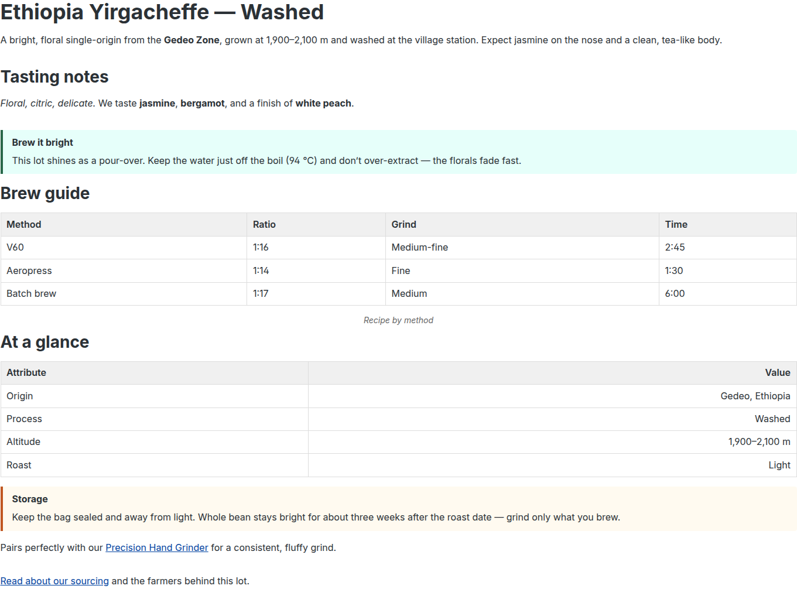
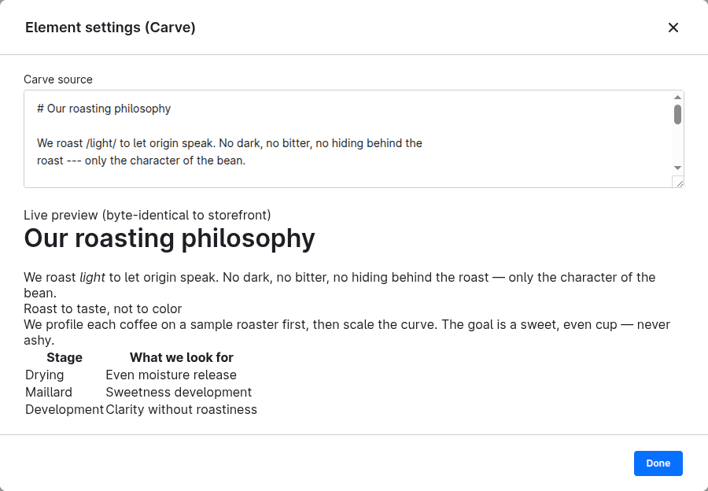
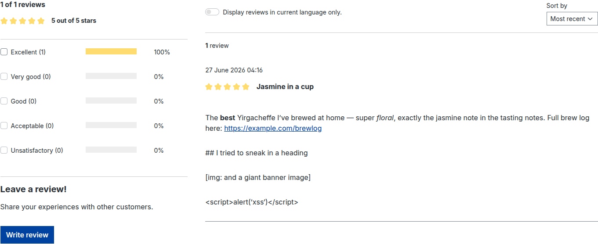

# shopware-carve

[](https://packagist.org/packages/markup-carve/shopware-carve)
[](https://github.com/markup-carve/shopware-carve/actions/workflows/ci.yml)
[](https://packagist.org/packages/markup-carve/shopware-carve)
[](https://packagist.org/packages/markup-carve/shopware-carve)
[](LICENSE)

Render [Carve](https://github.com/markup-carve/carve) markup to safe, semantic HTML in Shopware 6.
One source - ten surfaces: Twig filters, CMS elements, product/category/manufacturer fields,
admin live preview, transactional mail, inline product references, product reviews, and a CLI
renderer.

**Safe by default.** Raw HTML passthrough is off. `javascript:`, `data:`, `vbscript:`, `file:` URL
schemes are neutralized. `on*`, `srcdoc`, and `formaction` attributes are stripped. These protections
are always-on baselines independent of any plugin setting. No separate sanitizer needed. The `|carve`
filter is `is_safe => html` because carve-php's URL/attribute hardening is unconditional. For the full
threat model, a Carve-vs-Markdown comparison with examples, and the honest limits, see
[`docs/security.md`](docs/security.md).

- Composer: `markup-carve/shopware-carve`
- License: MIT
- Shopware: 6.6 and 6.7
- PHP: ^8.2
- Namespace: `MarkupCarve\Shopware\`

> **Pre-1.0 caveat.** Both `carve-php` and `carve-js` are design-exploration libraries. Syntax and
> output format can still change before 1.0. Pin versions explicitly and review the carve-php
> changelog before upgrades.

---

## Gallery

One plain-text source, rendered safely across the shop. The product description (left) and the
admin authoring view with live preview (right) come from the same Carve source:

| Storefront product description | Admin live preview |
|---|---|
|  |  |

Untrusted review text is hardened automatically - bold/italic/links survive, while headings, images,
and raw `<script>` degrade to inert text:



See **[`GALLERY.md`](GALLERY.md)** for all surfaces (CMS element, category and manufacturer copy,
transactional mail, inline product references, and the CLI renderer) with the Carve source behind
each screenshot.

---

## Enabled extensions

The following carve-php extensions are registered unconditionally on every HTML converter (both
`CarveRenderer` and `CarveContextRenderer`). They are pure-PHP and require no extra JavaScript.

| Extension | What it does |
|---|---|
| `AdmonitionExtension` | Converts `::: note`, `::: tip`, `::: warning`, `::: danger`, `::: info`, `::: success` divs to `<div class="admonition {type}">` with a `<p class="admonition-title">` header and an appropriate ARIA role. |
| `DetailsExtension` | Converts `::: details "Title"` to a native `<details><summary>Title</summary>...</details>` disclosure widget. |
| `ListTableExtension` | Converts `::: list-table` blocks (nested lists) to real `<table>` markup with `<thead>`/`<tbody>`/`<th>`/`<td>` and rowspan/colspan support. |
| `InlineFootnotesExtension` | Allows inline footnote syntax `[content]{.fn}` to generate numbered footnote references and an end-of-document footnotes section, sharing the numbering sequence with regular footnotes. |
| `AutolinkExtension` | Detects bare `https://`, `http://`, and `mailto:` URLs in text and turns them into clickable `<a>` links. |
| `ExternalLinksExtension` | Adds `rel="nofollow noopener"` and `target="_blank"` to all external HTTP/HTTPS links, including those produced by `AutolinkExtension`. |
| `TableOfContentsExtension` | Collects headings and makes a `<ul class="toc">` available via `getTocHtml()` (or auto-inserts at `position: 'top'`/`'bottom'` when configured). Not auto-inserted by default - use `position` option or call `getTocHtml()` manually. |
| `SpoilerExtension` | Block `::: spoiler "Title"` becomes a native `<details class="spoiler"><summary>Title</summary>...</details>` (collapsed by default - no JS). Inline `:spoiler[text]` becomes `<span class="spoiler">text</span>` (CSS blur-until-hover, no JS). |
| `CodeGroupExtension` | Converts `::: code-group` with labeled fenced blocks (e.g. ` ```bash [npm] `) to a tabbed group with `<input class="code-group-radio">` / `<label class="code-group-label">npm</label>` / `<div class="code-group-panel">` markup. Tab switching is CSS-only (radio hack) - no JavaScript. |
| `TabsExtension` | Converts `:::: tabs` / `::: tab "Title"` blocks to the same CSS radio-tab pattern with classes `tabs-radio` / `tabs-label` / `tabs-panel`. No JavaScript. |

Config-driven extensions (added only when enabled in the plugin settings): smart quotes
(`ShopwareCarve.config.smartQuotes`), Mermaid diagrams (`ShopwareCarve.config.enableMermaid`),
charts (`ShopwareCarve.config.enableCharts`) and PlantUML diagrams
(`ShopwareCarve.config.enablePlantuml`). Mermaid/chart lazy-load their library from a CDN, and
PlantUML renders via the external Kroki service - both only when a diagram is present. See the
Configuration section.

---

## Surfaces

### 1 - Twig filters `|carve`, `|carve_text`, `|carve_md`

**Benefit:** Render Carve to safe HTML, plain text, or Markdown from any theme template. The
universal primitive everything else builds on - safe output with no bolt-on sanitizer; plain and
Markdown variants enable channel reuse (mail, export).

```twig
{# HTML output (safe, is_safe => html) #}
{{ product.translated.description | carve }}

{# Plain text (e.g. for meta descriptions) #}
{{ product.translated.description | carve_text }}

{# Markdown (e.g. for export) #}
{{ product.translated.description | carve_md }}
```

For content that contains `:product[SKU]` inline references, use `|carve_ctx(context)` to pass the
sales channel context so product links resolve correctly (see Surface 8).

---

### 2 - Carve CMS element (shopping experiences)

**Benefit:** Drag and drop a safe rich-text block into any CMS page or product layout via the admin.
Non-developers author headings, bold text, tables, and admonitions with zero XSS surface and no
code execution.

Add the element type `carve` from the element panel in the Shopping Experiences editor. The element
renders its `content` field through `CarveRenderer::toHtml()` server-side. The admin config panel
shows a live preview (Surface 6).

---

### 3 - Product custom field `carve_body`

**Benefit:** Structured, diffable, translator-friendly product copy rendered under the product
description on the storefront. Source is plain text (versionable in git); identical in admin
preview and storefront.

After running migrations (see Install), a `carve_body` text area appears on the product detail
admin page. The plugin's storefront override renders it below the core description:

```twig
{# storefront/page/product-detail/description.html.twig - rendered automatically #}
{{ product.customFields.carve_body | carve }}
```

---

### 4 - Category custom field `carve_category_body`

**Benefit:** Safe rich text for category landing copy - same safety and determinism as product
fields but on category pages.

The plugin adds a `carve_category_body` field to category entities (via migration) and renders it in the
category CMS listing template automatically.

---

### 5 - Manufacturer/brand custom field `carve_manufacturer_body`

**Benefit:** Authored brand copy on the manufacturer entity - same Carve safety and admin UX as
the product and category fields.

The migration adds a `carve_manufacturer_body` text area to `product_manufacturer` entities in the
`carve` custom field set. It appears in the manufacturer admin form after running migrations.

Shopware core has no dedicated storefront manufacturer page and no stable override block that
renders manufacturer copy as rich text. The field is therefore **filter-only**: theme developers
render it at whatever point the brand is shown in their layout:

```twig
{# In any storefront template that has the manufacturer in scope #}

    <div class="carve-content carve-manufacturer-description">
        {{ product.manufacturer.translated.customFields.carve_manufacturer_body|carve }}
    </div>

```

For product references inside the manufacturer copy, use `|carve_ctx(context)` instead of `|carve`.

---

### 6 - Admin live preview (carve-js)

**Benefit:** While typing in the CMS element or custom fields, the preview updates instantly and is
byte-identical to the storefront output. WYSIWYG confidence via PHP/JS parity with no API roundtrip.

The admin CMS element config component (`sw-cms-el-config-carve`) imports `carveToHtml` from
`@markup-carve/carve` and calls it on every `input` event. The shared cross-implementation test
corpus guarantees that carve-js and carve-php produce the same bytes for the same source.

---

### 7 - Transactional mail rendering

**Benefit:** One Carve source feeds both the HTML part and the plain-text part of a multipart mail.
Safe interpolation of user/order data into mail bodies.

See [`docs/mail.md`](docs/mail.md) for the full setup. Short example:

```twig
{# HTML part of a mail template #}

## Order {{ order.orderNumber }}

Dear **{{ order.orderCustomer.firstName }}**,

your order is on its way.

{{ body | carve }}

{# Plain-text part of the same mail template #}
{{ body | carve_text }}
```

---

### 8 - Commerce inline type `:product[SKU]`

**Benefit:** Authors embed a live product reference (link with name and price) inline in any Carve
content, resolved against the current sales channel at render time. Markdown has no safe,
first-class way to embed live commerce entities in authored copy.

Use the `|carve_ctx(context)` filter (available in storefront templates as `context`) rather than
the plain `|carve` filter when the content may contain product references:

```twig
{{ product.customFields.carve_body | carve_ctx(context) }}
```

Unknown or out-of-stock SKUs degrade gracefully to inert text - no exceptions thrown.

---

### 9 - Product reviews (UGC)

**Benefit:** Shopware lets customers write review text as plain text; with this surface,
review bodies are rendered as rich Carve HTML using a hardened profile so customers can
use basic formatting (bold, italic, links, lists) without introducing XSS or structural
noise (no headings, no images, no raw HTML).

Enable via `ShopwareCarve.config.renderReviews` (default `false`). When enabled, the
plugin's storefront override of `component/review/review-item.html.twig` passes
`review.content` through the `|carve_ugc` filter instead of escaping it as plain text.
When disabled, the template falls back to `{{ review.content|e }}` - the same safe
output as unmodified Shopware.

```twig
{# Rendered automatically when renderReviews is on - no manual change needed #}
{{ review.content|carve_ugc }}
```

The `|carve_ugc` filter always uses:
- **Safe mode on** - raw HTML is never passed through, regardless of the global
  `allowRawHtml` setting.
- **Comment profile** - headings, images, tables, footnotes, raw HTML blocks, divs,
  thematic breaks, and math are all denied and degrade to plain text. Only basic inline
  formatting and block-level paragraphs, lists, blockquotes, and code blocks are allowed.
  External links get `rel="nofollow ugc"`. This is enforced unconditionally - the global
  `profile` config has no effect on `|carve_ugc`.

Note: Shopware has a built-in product review system but no native Q&A. For Q&A rendering
you would need a dedicated Q&A plugin that exposes review-like entities; wire those to
`|carve_ugc` in the same way.

---

### 10 - Multi-target CLI `carve:render`

**Benefit:** Render a `.crv` file or piped source to HTML, Markdown, plain text, or ANSI from the
console. Write once, show anywhere: storefront, email, terminal, and export from a single source.

```bash
# Render to HTML
bin/console carve:render path/to/content.crv --html

# Render to plain text
bin/console carve:render path/to/content.crv --plain

# Render to Markdown
bin/console carve:render path/to/content.crv --md

# Render with ANSI color (terminal output)
# (--term, not --ansi: the latter is reserved by Symfony's console to force color globally)
bin/console carve:render path/to/content.crv --term
```

---

## Using `|carve` in your own templates

The `|carve`, `|carve_text`, `|carve_md`, `|carve_ctx`, and `|carve_ugc` filters are registered
globally in the Twig environment. They work in any Shopware template surface - storefront themes,
transactional mail templates, Flow Builder mail bodies, document (invoice/delivery note) templates,
and on any custom entity's text field. No extra configuration is needed beyond installing the plugin.

**Custom storefront template** - render any text field from any entity:

```twig
{# Any storefront .html.twig with a Carve source in scope #}
{{ myEntity.translated.someCarveField|carve }}

{# With :product[SKU] inline references resolved against the current sales channel #}
{{ myEntity.translated.someCarveField|carve_ctx(context) }}
```

**Flow Builder / mail template** - one source, two mail parts:

```twig
{# HTML part of an email template #}

{{ body|carve }}

{# Plain-text part of the same email template #}
{{ body|carve_text }}
```

**Document (invoice / delivery note) template** - same filter, works in Twig-based document
overrides. Because documents are rendered once and stored as PDF, cache the output when the source
is long:

```twig
{# In a custom document Twig override #}


    {{ manufacturerCopy|carve }}

```

The manufacturer field added by the `carve_manufacturer_body` migration (Surface 5 above) follows
the same pattern - set the source in the admin, render it wherever your theme shows the brand.

### Building your own elements

Carve can resolve your own inline/block elements against live Shopware data
(prices, stock, product cards, legal snippets) at render time - the same
mechanism that powers `:product[SKU]`. See **[`docs/custom-elements.md`](docs/custom-elements.md)**
for the render-hook pattern, two complete worked examples (`:badge[...]` pure
markup and `:price[SKU]` live data), how to make an element opt-in via config,
and a catalog of commerce-specific element ideas.

---

## Install

### Prerequisites

shopware-carve depends on two libraries that are not yet published to Packagist or npm. Install
them from local clones until they are released.

#### PHP dependency: carve-php

Clone carve-php alongside your Shopware project root (adjust the path to suit your layout):

```bash
git clone https://github.com/markup-carve/carve-php ../carve-php
```

Add a `path` repository to your project's `composer.json` so Composer resolves it locally:

```json
{
    "repositories": [
        {
            "type": "path",
            "url": "../carve-php",
            "options": { "symlink": false }
        }
    ],
    "minimum-stability": "dev",
    "prefer-stable": true
}
```

Then require the plugin:

```bash
composer require markup-carve/shopware-carve
```

Verify the library loaded correctly:

```php
<?php
var_dump(class_exists('MarkupCarve\\Carve\\CarveConverter')); // bool(true)
```

Once carve-php is published to Packagist you can remove the `path` repository and run
`composer update` normally.

#### JS dependency: carve-js (admin live preview only)

Clone carve-js somewhere on your machine:

```bash
git clone https://github.com/markup-carve/carve-js /path/to/carve-js
```

Install it into the plugin's admin directory as a local file dependency:

```bash
cd custom/plugins/ShopwareCarve/src/Resources/app/administration
npm install /path/to/carve-js
```

This writes a `file:` reference into the plugin's `package.json`. Once `@markup-carve/carve` is
published to npm you can replace the local install with `npm install @markup-carve/carve`.

---

### Plugin installation

```bash
# Activate the plugin
bin/console plugin:install --activate ShopwareCarve

# Run migrations (adds carve_body to products, carve_category_body to categories)
bin/console database:migrate --all ShopwareCarve

# Build the admin (required for CMS element and live preview)
bin/console bundle:dump
bin/build-administration.sh
bin/console assets:install

# Compile storefront theme (picks up carve-content styles)
bin/console theme:compile

# Clear cache
bin/console cache:clear
```

---

## Configuration

Access the plugin settings via Admin - Extensions - My extensions - Carve - Configure.

| Key | Default | Description |
|-----|---------|-------------|
| `ShopwareCarve.config.allowRawHtml` | `false` | Allow raw HTML passthrough (see Security note below). |
| `ShopwareCarve.config.livePreview` | `true` | Show instant preview while editing a Carve CMS element in the admin. |
| `ShopwareCarve.config.smartQuotes` | `false` | Smart quotes (typographic): Converts straight quotes to locale-correct typographic quotes. |
| `ShopwareCarve.config.smartQuotesLocale` | `en` | Smart-quote language: Sets the locale for typographic quotes. Only applies when `smartQuotes` is enabled. Supported locales: en, de, de-CH, fr, es, it, pt, nl, pl, ru, uk, cs, hu, sv, da, fi, nb, nn, ja, zh. |
| `ShopwareCarve.config.profile` | `none` | Content profile: restricts which Carve elements appear in HTML output. Options: `none`, `article`, `comment`, `minimal`. See Content profile section below. |
| `ShopwareCarve.config.enableMermaid` | `false` | Lazy-load Mermaid.js from CDN and render ` ```mermaid ` blocks as diagrams. CDN must be in CSP. |
| `ShopwareCarve.config.enableCharts` | `false` | Lazy-load Chart.js from CDN and render ` ```chart ` blocks as charts. CDN must be in CSP. |
| `ShopwareCarve.config.enablePlantuml` | `false` | Render ` ```plantuml ` (and ` ```puml `) blocks as diagrams via the external Kroki service (`https://kroki.io`). Kroki must be in CSP `connect-src`; `img` must allow `data:`. |
| `ShopwareCarve.config.renderReviews` | `false` | Render product review text as Carve HTML (comment profile, always hardened). See Surface 9. |

### allowRawHtml

Controls whether authored raw HTML (fenced ` ```=html ` blocks and inline `` `...`{=html} `` spans)
is passed through to the output or escaped. Default: `false` (raw HTML is escaped).

Note that the following protections are **always on** regardless of this setting - they are a
baseline provided by carve-php and are not governed by `allowRawHtml`:

- `javascript:`, `data:`, `vbscript:`, and `file:` URL schemes are neutralized.
- `on*` event attributes, `srcdoc`, and `formaction` are stripped.

**Enable `allowRawHtml` only if every content author is fully trusted.** Enabling it while the
`|carve` filter is registered as `is_safe => html` creates a stored XSS vector - any author can
inject arbitrary HTML (including `<script>` tags) into the storefront.

### livePreview

When `true` (the default), the CMS element config panel renders an instant storefront-identical
preview powered by carve-js. Set to `false` to disable the preview (e.g. for performance or
when carve-js is not installed).

### smartQuotes

When `true`, carve-php's smart-quotes extension is applied to HTML output, converting straight
ASCII quotes (`"..."` and `'...'`) to locale-correct typographic equivalents. Only affects HTML
output (`|carve`, `|carve_ctx`) - plain-text and Markdown targets are not affected.

Default: `false`.

### smartQuotesLocale

Sets the locale used to choose typographic quote characters. Only takes effect when `smartQuotes`
is `true`.

Default: `en` (English curly quotes: `"..."` / `'...'`).

Supported locales:

| Locale | Description |
|--------|-------------|
| `en` | English |
| `de` | German (de) |
| `de-CH` | German (Switzerland) |
| `fr` | French |
| `es` | Spanish |
| `it` | Italian |
| `pt` | Portuguese |
| `nl` | Dutch |
| `pl` | Polish |
| `ru` | Russian |
| `uk` | Ukrainian |
| `cs` | Czech |
| `hu` | Hungarian |
| `sv` | Swedish |
| `da` | Danish |
| `fi` | Finnish |
| `nb` | Norwegian Bokmal |
| `nn` | Norwegian Nynorsk |
| `ja` | Japanese |
| `zh` | Chinese |

Note: future versions may auto-derive the locale from the Shopware sales channel language.

### enableMermaid

When `true`, ` ```mermaid ` fenced code blocks are rendered as interactive Mermaid diagrams.
The Mermaid.js library is lazy-loaded from jsDelivr CDN (`https://cdn.jsdelivr.net/npm/mermaid@11/dist/mermaid.esm.min.mjs`)
only when at least one `<pre class="mermaid">` element is present on the page.

Default: `false`.

### enableCharts

When `true`, ` ```chart ` fenced code blocks (containing a Chart.js config as JSON) are rendered
as charts. The Chart.js library is lazy-loaded from jsDelivr CDN (`https://cdn.jsdelivr.net/npm/chart.js@4/+esm`)
only when at least one `<div class="chart">` element is present on the page.

Default: `false`.

### enablePlantuml

When `true`, ` ```plantuml ` (and ` ```puml `) fenced code blocks are rendered as diagrams.
carve-php emits `<pre class="plantuml">SOURCE</pre>`; PlantUML has no in-browser renderer, so the
storefront JS sends each block's source to the external **Kroki** service
(`https://kroki.io/plantuml/svg`, HTTP POST as `text/plain`) only when at least one
`<pre class="plantuml">` element is present on the page. The returned SVG replaces the `<pre>`
with an inline ``. No client library is loaded (Kroki
needs none). On a network/service error the original code block stays visible.

> [!IMPORTANT]
> The diagram source is transmitted to the public `kroki.io` service. If your content is
> confidential, [self-host Kroki](https://docs.kroki.io/kroki/setup/install/) and change
> `KROKI_PLANTUML_URL` in `src/Resources/app/storefront/src/carve-diagrams.js` to your instance.

Default: `false`.

### profile (Content profile)

Restricts which Carve node types are rendered in HTML output. Use `comment` or `minimal` for
untrusted user content such as product reviews, Q&A answers, or any other UGC surface. Disallowed
elements degrade to plain text by default (carve-php's `ACTION_TO_TEXT`). Applies to HTML output
only (`|carve`, `|carve_ctx`) - text and Markdown converters are never profiled.

Default: `none` (no restriction).

| Value | Name | What it restricts |
|-------|------|-------------------|
| `none` | None | No restrictions. All Carve elements render normally. |
| `article` | Article | Denies raw HTML blocks and inline raw HTML only. All other formatting (headings, images, tables, footnotes, etc.) is allowed. Suitable for blog posts and articles from trusted authors who must not embed scripts. |
| `comment` | Comment (UGC) | Allows only basic inline formatting (bold, italic, strikethrough, code, links, insert/delete/highlight/superscript/subscript) and block-level paragraphs, lists, blockquotes, and code blocks. Denies headings, images, tables, footnotes, raw HTML, divs, sections, definition lists, thematic breaks, and math. Links get `rel="nofollow ugc"`. Max nesting depth: 4. |
| `minimal` | Minimal (inline only) | Allows basic inline formatting (bold, italic, strikethrough, code, insert/delete/superscript/subscript, soft/hard breaks) and block-level paragraphs and lists only. Denies links, images, headings, tables, blockquotes, footnotes, raw HTML, and all advanced elements. Max nesting depth: 2. Suitable for chat messages and micro-posts. |
| `full` | Full | Explicitly marks all features as allowed. Functionally equivalent to `none` but records intent. Use for trusted admin content. |

#### Custom profile (PHP escape hatch)

There is no UI for a fully custom profile. To apply bespoke restrictions, build a `Profile`
directly in PHP and set it on the converter before rendering. The simplest approach is to decorate
or replace `CarveRenderer` in your own plugin:

```php
use MarkupCarve\Carve\CarveConverter;
use MarkupCarve\Carve\Profile;

// Example: comment profile but also deny links
$profile = Profile::comment()
    ->denyInline(['link'])
    ->setMaxNesting(3)
    ->onDisallowed(Profile::ACTION_STRIP); // strip instead of converting to text

$converter = new CarveConverter();
$converter->setProfile($profile);
$html = $converter->convert($source);
```

For the full list of node type constants, see
[`Carve\NodeType`](https://github.com/markup-carve/carve-php/blob/main/src/NodeType.php) in the
carve-php library and the node-type vocabulary in `docs/profiles.md` in the Carve spec.

### CDN, Kroki and CSP

When either `enableMermaid` or `enableCharts` is turned on, the storefront loads the
corresponding library from `https://cdn.jsdelivr.net`. If your shop enforces a Content Security
Policy, add `https://cdn.jsdelivr.net` to both `script-src` and `connect-src`.

When `enablePlantuml` is turned on, the storefront instead POSTs the diagram source to the
external Kroki service at `https://kroki.io` and inlines the returned SVG as an `` data URI
(no library is loaded). For a CSP, add:

- `https://kroki.io` to `connect-src` (the `fetch` POST), and
- `data:` to `img-src` (the inlined SVG data URI).

If you self-host Kroki, substitute your own origin for `https://kroki.io` in both the CSP and
`KROKI_PLANTUML_URL` in `carve-diagrams.js`.

---

## Security note

The `|carve` and `|carve_ctx` filters are marked `is_safe => html` - meaning Twig will not
double-escape their output. This is safe because carve-php provides always-on hardening that
cannot be disabled by any plugin setting:

- `javascript:`, `data:`, `vbscript:`, and `file:` URL schemes are neutralized.
- `on*` event attributes, `srcdoc`, and `formaction` are stripped.
- Parse depth and input size are bounded against DoS.

The only thing the `ShopwareCarve.config.allowRawHtml` setting controls is whether authored raw
HTML (fenced ` ```=html ` blocks and inline `` `...`{=html} `` spans) is passed through or
escaped. By default (`allowRawHtml = false`) raw HTML is escaped and cannot reach the output.

**Enable `allowRawHtml` only if all content authors are fully trusted.** Enabling it while
`is_safe => html` is in the Twig filter registration creates a stored XSS vector - authors can
inject arbitrary HTML including `<script>` tags into the storefront.

---

## Shopware version support

| Shopware | Supported |
|---|---|
| 6.6.x | Yes |
| 6.7.x | Yes |
| < 6.6 | No |

---

## License

MIT - see [LICENSE](LICENSE).
